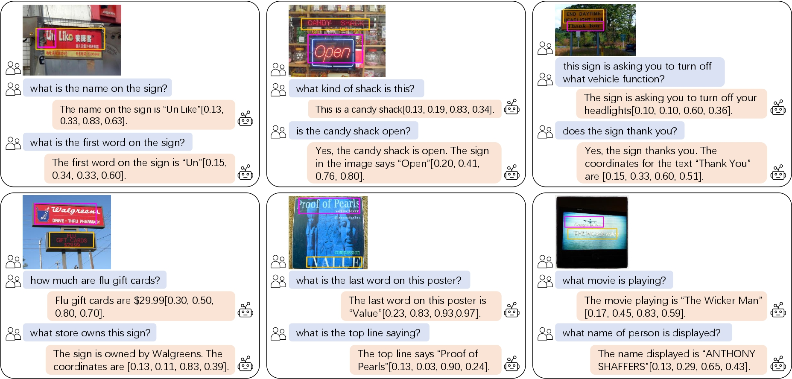
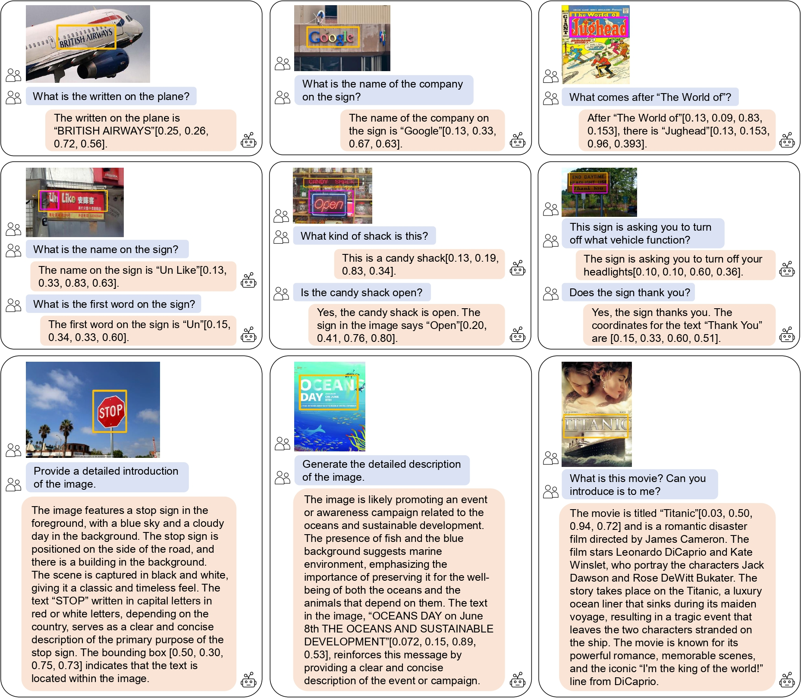

# TGDoc

Towards Improving Document Understanding: An Exploration on Text-Grounding via MLLMs

[Paper](https://arxiv.org/abs/2311.13194)

## Pretrained Models

[tgdoc-7b-finetune-224](https://pan.baidu.com/s/1-FA2hJrDS0y6fovtCkvzlw) Code: gxqt

[tgdoc-13b-finetune-224](https://pan.baidu.com/s/1U85erwbxBD55cdMAu_9gCg) Code: gxqt 


## Installation

Following the installation of [llava](https://github.com/haotian-liu/LLaVA)

```shell
git clone https://github.com/haotian-liu/LLaVA.git
cd LLaVA

conda create -n llava python=3.10 -y
conda activate llava
pip install --upgrade pip  # enable PEP 660 support
pip install -e .

pip install flash-attn --no-build-isolation
```

some package version

```
deepspeed==0.9.5
peft==0.4.0
transformers==4.31.0
accelerate==0.21.0
bitsandbytes==0.41.0
```

**Note**: If you use a GTX 3090 machine, you need to enable deepspeed, and you must maintain the CUDA version at 11.7, otherwise the loss will not be optimized during the training process. This issue does not occur with the A100 when not using deepspeed.

## Datasets

Download the llava and llavar dataset

Our full datasets can be download from [here](https://pan.baidu.com/s/1h0r9gCgBKShyzRPeDZsrPA) Code: gxqt

## Train

Modify the configuration file in `llava/data/config.py`.

#### Pretraining

For 8-3090-24G, run `bash scripts/pretrain_deep.sh`

For  8-A100-40G, run `bash scripts/pretrain_20.sh`

#### Fine-tuning

For 8-3090-24G, run `bash scripts/finetune_deep.sh`

For  8-A100-40G, run `bash scripts/finetune_20.sh`

#### Inference

modify the `model-path` param to use different models.

```shell
bash scripts/cli2_a16.sh
```

We used the widely used [MultimodalOCR](https://github.com/Yuliang-Liu/MultimodalOCR) to validate our method. As noted in the paper, we added "Support your reasoning with the coordinates [xmin, ymin, xmax, ymax]" at the end of each question.


## Cases

qualitative results on the validation set.

examples1



examples2




## Citations

```
@article{wang2023towards,
  title={Towards Improving Document Understanding: An Exploration on Text-Grounding via MLLMs},
  author={Wang, Yonghui and Zhou, Wengang and Feng, Hao and Zhou, Keyi and Li, Houqiang},
  journal={arXiv preprint arXiv:2311.13194},
  year={2023}
}
```

## Acknowledgement

The code are bring heavily from [LLaVA](https://github.com/haotian-liu/LLaVA), Thanks for their great work.

**Note**: We have simplified the code in LLaVA to make it easier to read.


