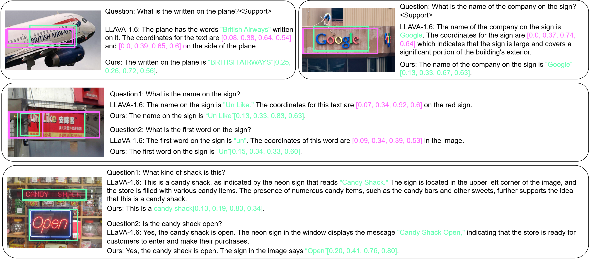

# TGDoc: Text-Grounding Document Understanding with MLLMs

[](https://arxiv.org/abs/2311.13194) [](https://www.python.org/downloads/) [](https://opensource.org/licenses/MIT)

## 🚀 Overview

TGDoc is a model that enhances document understanding by implementing text-grounding capabilities in Multimodal Large Language Models (MLLMs). Our approach improves the ability to process and comprehend document-based information.

## 🛠️ Quick Start

### Prerequisites

This project builds upon [LLaVA](https://github.com/haotian-liu/LLaVA). Set up your environment:

```bash
git clone https://github.com/haotian-liu/LLaVA.git
cd LLaVA

conda create -n llava python=3.10 -y
conda activate llava

pip install --upgrade pip
pip install -e .
pip install flash-attn --no-build-isolation
```

### Dependencies
```plaintext
deepspeed==0.9.5
peft==0.4.0
transformers==4.31.0
accelerate==0.21.0
bitsandbytes==0.41.0
```

## Resources

### Pretrained Models

| Model Name | Download Link | Access Code |
|------------|---------------|-------------|
| tgdoc-7b-finetune-336 | [Download](https://pan.baidu.com/s/1m8Ixa7fUqNPPW1i-Y4AMjA?pwd=xhif) | xhif |

### Dataset
- Complete dataset: [Download](https://pan.baidu.com/s/1h0r9gCgBKShyzRPeDZsrPA) (Access Code: gxqt)
- Includes LLaVA and LLaVAR datasets

#### Dataset Examples
- PPT Data Examples:
  

- CC3M Finetuning Examples:
  

## Usage

### Training

1. Configure settings in `llava/data/config.py`
2. Select appropriate training script: `bash scripts/pretrain.sh` and `bash scripts/finetune.sh`

### Inference

```bash
python test.py
```

We use [MultimodalOCR](https://github.com/Yuliang-Liu/MultimodalOCR) for validation, appending each question with: "Support your reasoning with the coordinates [xmin, ymin, xmax, ymax]"

## Results

### Qualitative Examples


## Citation

```bibtex
@article{wang2023towards,
  title={Towards Improving Document Understanding: An Exploration on Text-Grounding via MLLMs},
  author={Wang, Yonghui and Zhou, Wengang and Feng, Hao and Zhou, Keyi and Li, Houqiang},
  journal={arXiv preprint arXiv:2311.13194},
  year={2023}
}
```

## Acknowledgments

This project builds upon [LLaVA](https://github.com/haotian-liu/LLaVA). We thank the original authors for their great work.